# Architecture & Component Block Diagrams

High-level block diagrams for the `rsqlite-rsync` repository using Mermaid format.

---

## 1. Complete End-to-End System Architecture

Comprehensive system map unifying application clients, connection pooling, gRPC request dispatching, distributed HA lease coordination, and the rsync delta-sync data plane.

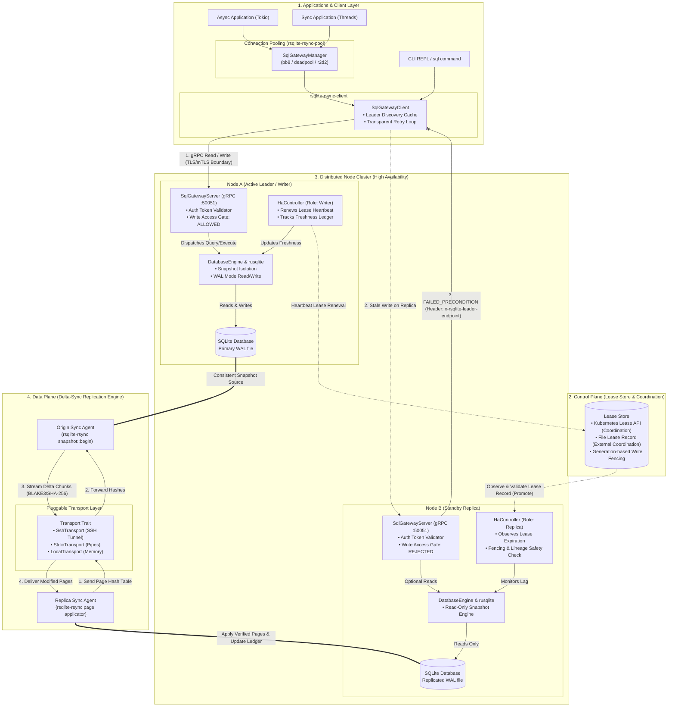

---

## 2. Workspace & Crate Structure

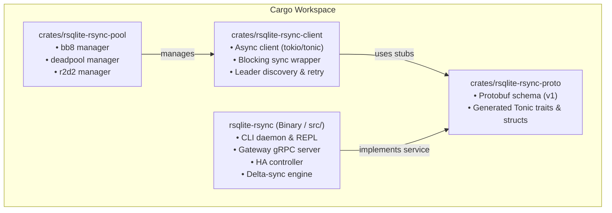

---

## 3. Server Architecture & Request Routing

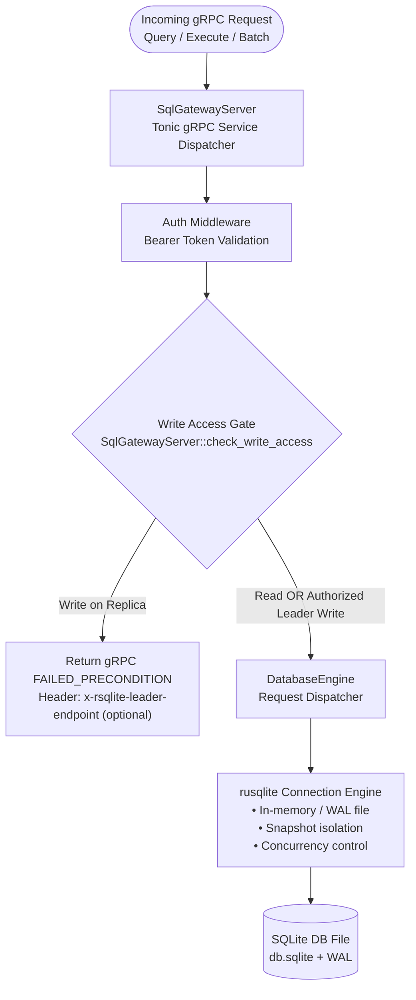

---

## 4. rsync-Style Delta Replication Flow

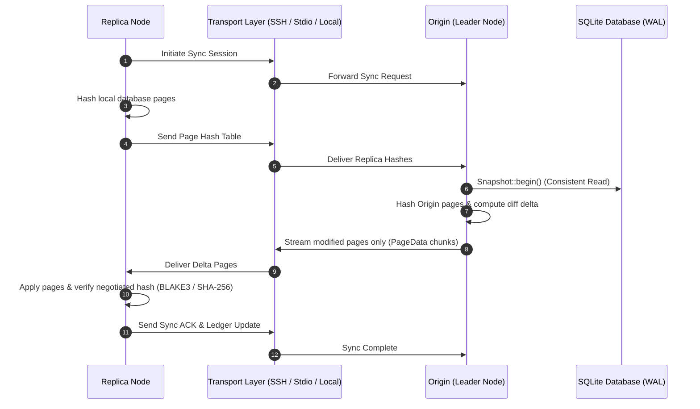

---

## 5. High Availability (HA) & Lease Management

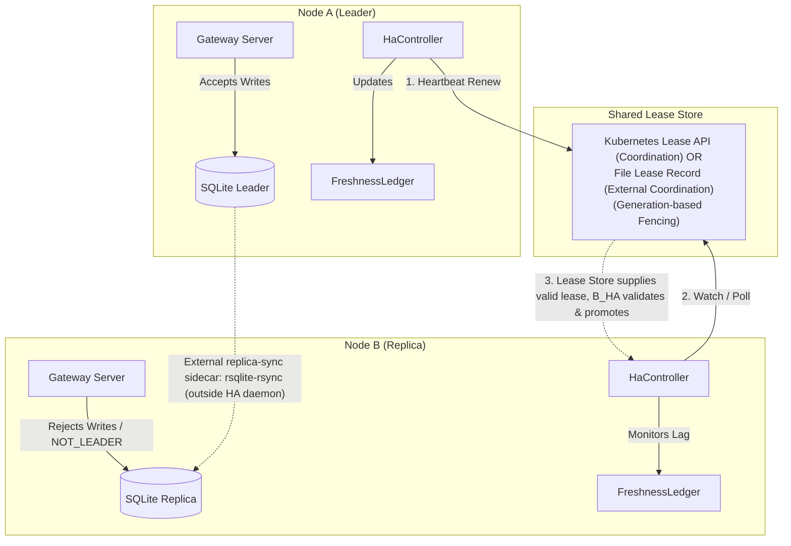

---

## 6. Client Library & Connection Pooling Architecture

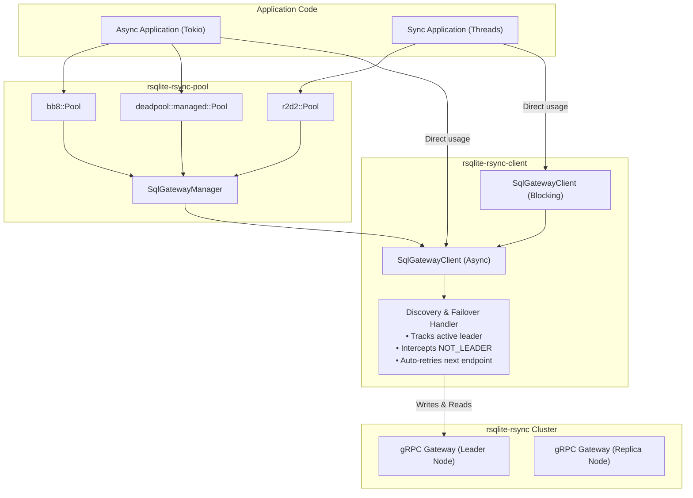

---

## 7. Modes of Operation

`rsqlite-rsync` operates in four distinct execution modes depending on CLI flags and subcommands:

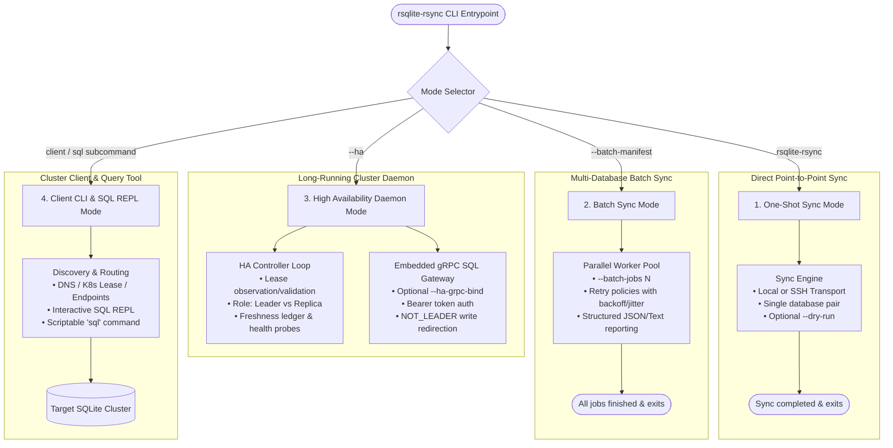

---

## 8. High Availability (HA) vs. Standalone (SA) Modes

Comparison between running `rsqlite-rsync` in Standalone (SA) local mode vs. a distributed High Availability (HA) cluster.

> **Security Note on Transports:** The gRPC SQL Gateway does not terminate TLS internally. Plaintext HTTP endpoints (such as `http://node-a:50051`) are suitable only within trusted network perimeters or behind TLS/mTLS termination proxies; untrusted networks must terminate TLS in front of the gateway.

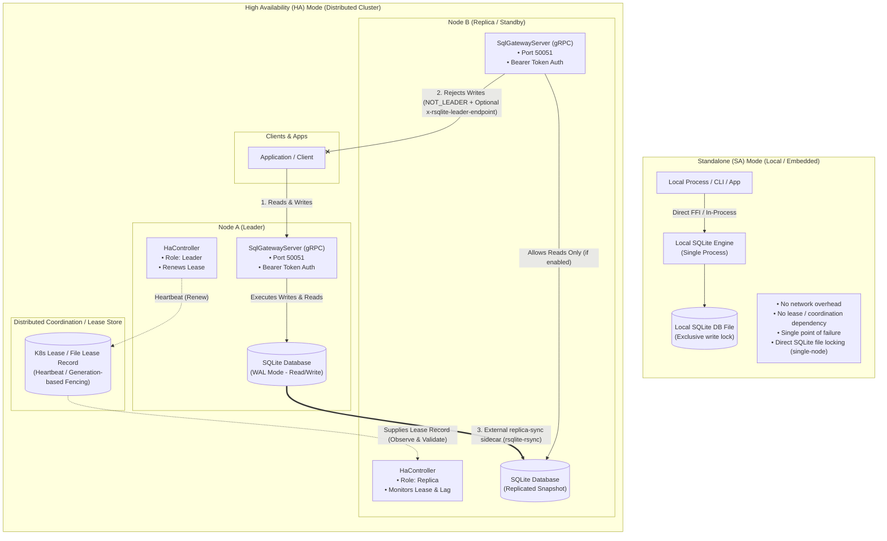

---

## 9. HA Controller State Machine & Reconcile FSM

Node lifecycle, reconciliation decisions, and safety fencing (lease expiration, freshness lag, and lineage checks).

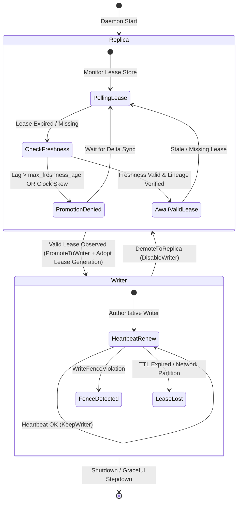

---

## 10. Client Transparent Leader Redirection & Failover Flow

How `rsqlite-rsync-client` and the CLI REPL intercept `NOT_LEADER` (`FAILED_PRECONDITION`) responses to transparently follow `x-rsqlite-leader-endpoint` redirection headers.

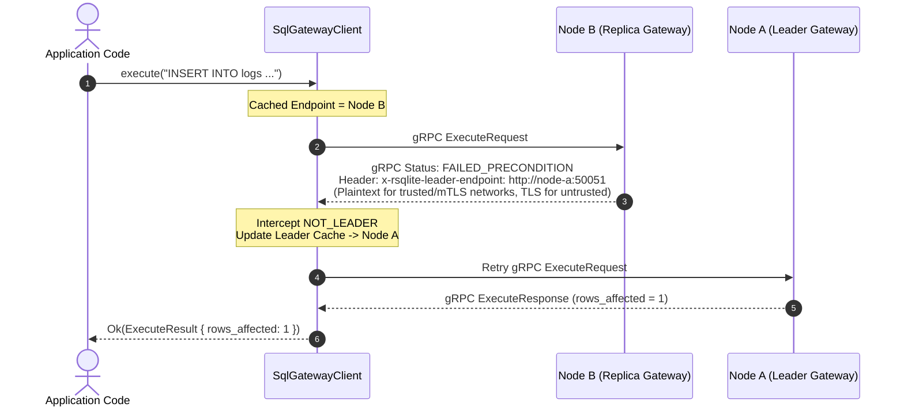

---

## 11. Pluggable Transport Layer Architecture

Abstraction hierarchy for data-plane sync transfers across in-memory buffers, local files, and secure SSH tunnels.

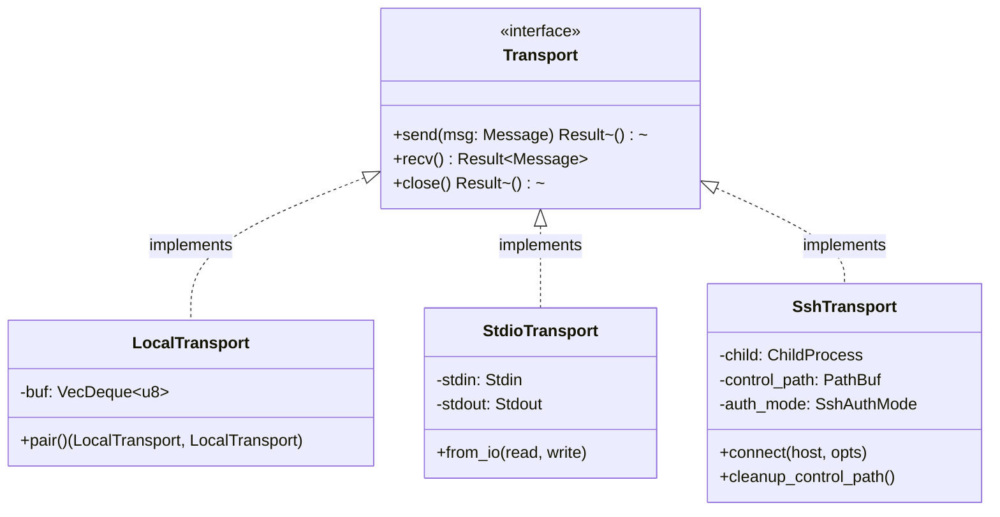

---

## 12. Batch Multi-Database Sync Pipeline

Manifest-driven parallel sync execution with thread-pool concurrency, exponential backoff with jitter, and structured run reporting.

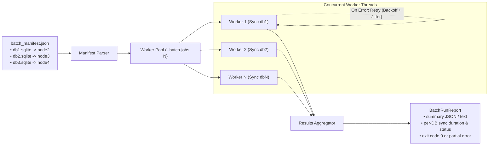
