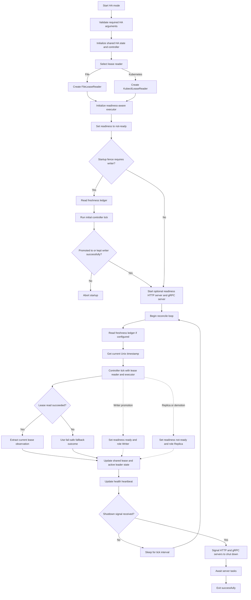

```mermaid
flowchart TD
    A[Start HA mode] --> B[Validate required HA arguments]
    B --> C[Initialize shared HA state and controller]
    C --> D[Select lease reader]
    D -->|File| E[Create FileLeaseReader]
    D -->|Kubernetes| F[Create KubectlLeaseReader]
    E --> G[Initialize readiness-aware executor]
    F --> G
    G --> H[Set readiness to not-ready]
    H --> I{Startup fence requires writer?}
    I -->|Yes| J[Read freshness ledger]
    J --> K[Run initial controller tick]
    K --> L{Promoted to or kept writer successfully?}
    L -->|No| M[Abort startup]
    L -->|Yes| N[Start optional readiness HTTP server and gRPC server]
    I -->|No| N
    N --> O[Begin reconcile loop]
    O --> P[Read freshness ledger if configured]
    P --> Q[Get current Unix timestamp]
    Q --> R[Controller tick with lease reader and executor]
    R --> S{Lease read succeeded?}
    S -->|Yes| T[Extract current lease observation]
    S -->|No| U[Use fail-safe fallback outcome]
    T --> V[Update shared lease and active leader state]
    U --> V
    V --> W[Update health heartbeat]
    W --> X{Shutdown signal received?}
    X -->|No| Y[Sleep for tick interval]
    Y --> O
    X -->|Yes| Z[Signal HTTP and gRPC servers to shut down]
    Z --> AA[Await server tasks]
    AA --> AB[Exit successfully]

    R -.->|Writer promotion| AC[Set readiness ready and role Writer]
    R -.->|Replica or demotion| AD[Set readiness not-ready and role Replica]
    AC -.-> V
    AD -.-> V
```